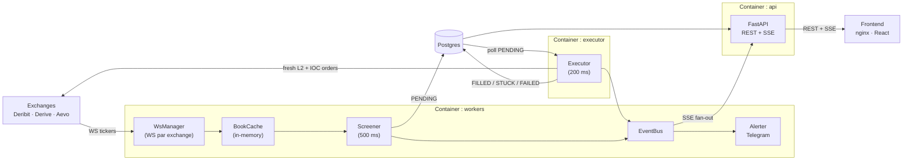
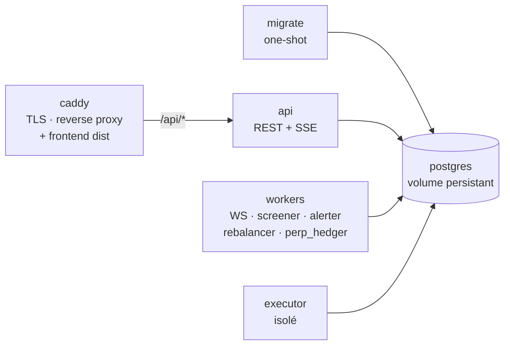

# Option Arbitrage — Architecture, Décisions, Problèmes résolus

> Document de référence complet. Public : moi dans six mois, ou quelqu'un qui reprend le projet.

---

## Pourquoi ce projet existe

L'idée de départ est simple : les marchés d'options crypto sont jeunes, fragmentés, et peu arbitrés. Sur les marchés actions, une option identique cotée sur deux venues simultanément converge en millisecondes — des dizaines de market makers automatisés s'en chargent. En crypto options, Deribit, Derive (ex-Lyra), Aevo et d'autres coexistent sans que leurs carnets d'ordres soient mécaniquement liés. Il arrive qu'un `BTC-20251025-70000-C` se vende à 0.025 BTC sur Deribit et se revende à 0.028 BTC sur Derive — un écart net de frais qui représente de l'argent gratuit si on est assez rapide.

La stratégie est déterministe, non directionnelle, et théoriquement sans risque de marché (les deux jambes sont hedgées simultanément). En pratique, le risque est ailleurs : latence d'exécution, liquidité moindre que ce que le carnet affiche, signing cryptographique par ordre côté Derive, différences de settlement à l'expiry.

J'ai commencé par un prototype TypeScript avec Trigger.dev pour l'orchestration et Telegram pour les alertes. Ce prototype a permis de valider le concept et de cartographier les pièges. Il a ensuite été entièrement supprimé : la codebase Python est le seul point de vérité depuis la phase 1.

---

## Le concept en une phrase

Pour chaque instrument option listé sur au moins deux exchanges, détecter en temps réel quand `bid_exchange_A > ask_exchange_B` net de frais de taker, puis exécuter simultanément un achat sur B et une vente sur A avant que l'écart disparaisse.

### La formule

```
spread_brut%  = (bid_A - ask_B) / ask_B × 100
fee%          = (taker_rate_A + taker_rate_B) × 100
spread_net%   = spread_brut% - fee%
APR           = (spread_net% / jours_avant_expiry) × 365
```

L'APR ramène l'opportunité à une base annuelle comparable à un rendement obligataire — c'est le filtre principal de qualité.

---

## Vue d'ensemble de l'architecture



### Topologie des containers



Le choix de séparer `executor` en container isolé est délibéré : c'est le composant le plus dangereux. Un crash du screener ou de l'alerter ne doit pas interrompre une exécution en cours. De même, redémarrer l'executor seul ne touche pas les connexions WS actives.

---

## Module par module

### `exchanges/base.py` — Le contrat d'interface

Tout commence ici. `AbstractExchange` est la classe de base que chaque adaptateur implémente. Les dataclasses clés :

- **`Instrument`** : représente un instrument d'options — underlying, strike, expiry, option_type, taker_fee_rate, `min_trade_amount`, adresses spécifiques Derive pour le signing (`asset_address`, `asset_sub_id`).
- **`Book`** : carnet d'ordres — liste de `BookLevel(price, size)` pour bids et asks.
- **`OrderRequest`** / **`OrderResult`** : demande de placement et résultat (FILLED, PARTIAL, REJECTED, CANCELLED).
- **`TickerUpdate`** : snapshot top-of-book émis par le WebSocket.

Le champ `normalized_name = {UNDERLYING}-{YYYYMMDD}-{STRIKE}-{C|P}` est l'invariant fondamental. Toute la logique de matching cross-exchange dépend de ce format unique. Si deux instruments ont le même `normalized_name`, ce sont les mêmes options sous-jacentes, peu importe leur nom natif sur chaque exchange.

`AbstractExchange` définit aussi `get_available_funds()` avec un no-op par défaut — les exchanges non authentifiés retournent `{}` proprement au lieu de planter.

### `exchanges/http.py` — La couche HTTP

`RestClient` est un wrapper `httpx.AsyncClient` avec trois couches de protection :

**1. Rate limiting par leaky bucket (aiolimiter)**

Chaque exchange a son propre `RestClient` avec un budget de requêtes/seconde configuré dans `config.yaml`. Le point délicat : l'executor ne doit pas être privé de ses slots par les rafales de metadata refresh ou de book snapshots. Solution : deux lanes. Le quota total est divisé en `normal` (screener, metadata) et `priority` (executor). L'executor passe toujours en `priority=True`. Concrètement, si le limit est 20 req/s, l'executor a 5 slots réservés que les autres ne peuvent pas consommer.

**2. Retry avec backoff exponentiel**

Sur HTTP 429 ou 5xx, backoff de `0.5s * 2^attempt`, cappé à 10s. L'en-tête `Retry-After` est honnoré s'il est présent. Après `max_retries` (défaut 3), l'exception est propagée.

**3. Circuit breaker**

Après 5 échecs en 30s, le circuit s'ouvre. Pendant 30s de cooldown, toutes les requêtes lèvent `CircuitOpenError` immédiatement sans tenter le réseau. Ensuite il passe en demi-ouvert et se réinitialise au premier succès. Cela évite de martelar un exchange en difficulté.

### `exchanges/auth.py` + `exchanges/derive_auth.py` — L'authentification

L'authenticator est optionnel : sans lui, les méthodes privées retournent `REJECTED` / `{}` proprement. Chaque adaptateur prend un `Authenticator | None` à la construction.

**`NoAuth`** — Les endpoints publics. Lève `AuthNotReady` si une méthode privée est appelée.

**`DeribitOAuth`** — OAuth 2.0 `client_credentials`. Le token est fetchée au premier appel privé, mis en cache, et rafraîchi automatiquement 60s avant expiry (TTL Deribit ≈ 3600s). Le refresh est protégé par un `asyncio.Lock` pour éviter les races si deux coroutines expirent simultanément.

**`DeriveAuth`** — Le cas le plus complexe. Derive (Lyra V2) est un protocole on-chain (OP Stack, chain_id 957 mainnet). Chaque ordre nécessite :

1. **Signing EIP-712** de l'action via `sign_trade_action()` — construit un `SignedAction` avec `TradeModuleData`, signe le digest `keccak(0x1901 || DOMAIN_SEPARATOR || action_hash)` avec la session key, et valide la signature en self-check avant d'envoyer.
2. **Headers REST** `X-LYRAWALLET`, `X-LYRATIMESTAMP`, `X-LYRASIGNATURE` sur chaque appel `/private/*` — signés différemment (pas EIP-712, signature simple du timestamp en hex).

Les constantes de protocole (DOMAIN_SEPARATOR, ACTION_TYPEHASH, TRADE_MODULE, WITHDRAW_MODULE, USDC_ASSET) sont dans `derive_constants.py` pour mainnet (chain_id=957) et testnet (chain_id=901). Elles viennent de la doc officielle `docs.derive.xyz/docs/protocol-constants`.

### `exchanges/deribit.py` — L'adaptateur Deribit

Deribit expose une API JSON-RPC sur HTTPS et WSS. L'adaptateur gère deux modes via la config :

- **Inverse** (`deribit`) : contrats BTC-PERPETUAL et options BTC/ETH cotées en sous-jacent. Le piège majeur ici : `best_bid_price = 0.025` pour un call BTC ne signifie pas 0.025 USD — c'est 0.025 × prix_BTC_USD. L'adaptateur multiplie systématiquement par `underlying_price` à la réception, que ce soit en REST ou en WS.
- **Linear** (`deribit_linear`) : options USDC, cotées directement en USD. Pas de conversion.

Le WS Deribit a une particularité : les messages ticker n'incluent pas toujours `underlying_price` (notamment lors d'une reconnexion partielle). Si le champ est absent, `parse_ws_message` retourne `None` — le book_cache garde l'ancienne valeur plutôt que de propager un prix erroné.

L'adaptateur expose aussi `get_perp_position_usd()` et `place_perp_order()` pour le perp hedger, et `get_index_price()` pour calculer la valeur BTC en USD.

`get_available_funds()` appelle `private/get_account_summary` par currency — USDC pour le linear, BTC + ETH pour l'inverse.

### `exchanges/derive.py` — L'adaptateur Derive

Derive est plus simple côté prix (tout en USD) mais plus complexe côté auth. Chaque ordre passe par `DeriveAuth.sign_trade_action()` qui retourne un dict JSON que l'on merge dans le payload `/private/order`.

`get_available_funds()` appelle `/private/get_subaccount` et retourne `max(collaterals_value - initial_margin, 0)` comme USDC disponible — proxy conservateur de ce qu'on peut réellement dépenser.

Le `minimum_amount` de chaque instrument est peuplé dans `Instrument.min_trade_amount` depuis la réponse `/public/get_instruments`.

### `exchanges/aevo.py` — L'adaptateur Aevo (partiel)

Aevo n'a pas de canal WebSocket pour les options. Le polling REST instrument par instrument est trop lent et consomme trop de quota rate. Aevo est donc **exclu du screener** — il reste dans la config pour référence et usage manuel futur. L'adaptateur est public uniquement (`NoAuth`), le signing est différé.

### `exchanges/mock.py` + `exchanges/slippage.py` — Le simulateur

`MockExchange` est le jumeau papier de n'importe quel adaptateur. Il intercepte `place_order()` et simule les fills via `SlippageModel`. Toute la stack screener + executor tourne identiquement en mode paper — seul l'adaptateur injecté diffère.

`SlippageModel` walk le carnet L2, applique un bruit gaussien sur le prix moyen (`noise_stdev_bps=10` par défaut), une probabilité de rejet aléatoire (2%), une latence simulée (50-300ms), et respecte le prix limite (si le fill dépasse le limit price, `REJECTED`). En test, le seed RNG est fixé (`rng_seed=42`) et les paramètres de bruit mis à 0 pour des résultats déterministes.

### `exchanges/naming.py` — La normalisation des noms

C'est le ciment du matching cross-exchange. `normalize_deribit("BTC-25OCT25-30000-C")` → `"BTC-20251025-30000-C"`. `normalize_from_parts(underlying, expiry_dt, strike, opt_type)` est la version générique.

Piège détecté : les strikes Derive peuvent être décimaux (`3000.5`), Deribit toujours entiers. Le comparateur compare des strings. `normalize_from_parts` formate le strike en entier si c'est un entier, décimal sinon — mais ça peut encore rater si un strike est `3000` chez l'un et `3000.0` chez l'autre selon comment l'API le retourne. À surveiller.

### `exchanges/registry.py` — L'instanciation

`build_exchanges(config)` lit `config.yaml`, instancie chaque adaptateur avec son `Authenticator` correct, et retourne le dictionnaire `{name: AbstractExchange}`. C'est le seul endroit où les credentials sont passés.

### `market/book_cache.py` — Le cache in-memory

`BookCache` est un dictionnaire `(exchange, normalized_name) → CachedTicker`. Alimenté par `WsManager` via callback `on_ticker`, lu par le screener toutes les 500ms. Tout tient en mémoire — c'est voulu. La plupart des options ont des carnets peu actifs ; stocker les snapshots en DB serait trop coûteux pour un gain nul.

`snapshot()` retourne la liste de tous les tickers connus. `by_normalized_name()` les groupe par instrument pour le comparateur.

### `market/ws_manager.py` — Les connexions WebSocket

`WsManager` gère une connexion WSS par exchange. Fonctionnalités clés :

- **Reconnexion automatique** avec backoff exponentiel (max 60s). À chaque reconnexion, les channels sont re-souscrits automatiquement.
- **Re-subscribe** : après reconnect, `WsManager` renvoie les messages subscribe pour tous les channels enregistrés — sinon le carnet reste muet.
- **Dispatch** : chaque message reçu est passé à `exchange.parse_ws_message()`, qui retourne un `TickerUpdate | None`. Les `None` sont ignorés silencieusement.
- **Ping/pong** : `ping_interval=20s`, `ping_timeout=20s`. Sans ça, certains exchanges ferment la connexion silencieusement après quelques minutes.
- Les exchanges sans WS (`ws_channels() == []`) ne démarrent pas de connexion — Aevo notamment.

### `services/comparator.py` — La détection d'arbitrage

Le comparateur reçoit une liste de `Quote` (snapshot du cache), les groupe par `normalized_name`, et pour chaque groupe teste toutes les paires d'exchanges. La logique :

1. Filtrer les quotes invalides (prix ou taille nuls).
2. Filtrer les quotes en dessous du plancher de liquidité (`bid_price × bid_qty >= size_threshold_usd`).
3. Trouver `lowest_ask` (achat) et `highest_bid` (vente) **sur des exchanges différents**.
4. Calculer `spread_net% = spread_brut% - fee%`. Si ≤ 0, ignorer.
5. Calculer `APR = (spread_net% / jours) × 365`.
6. `max_notional_usd = min(ask_qty × ask_price, bid_qty × bid_price)` — le notionnel liquide maximal, côté le plus petit.

Tout est en `Decimal` pour éviter les erreurs flottantes sur des spreads parfois inférieurs à 0.1%.

C'est un port direct du `compareOptions` TypeScript du prototype — la sémantique est identique, le type est plus strict.

### `services/screener.py` — La boucle de détection

Le screener tourne dans le container `workers`, toutes les 500ms. Il lit le `BookCache`, appelle le comparateur, et pour chaque `Spread` détecté :

- Si une opportunité identique (même instrument, mêmes exchanges, statut `PENDING`) existe déjà, il la met à jour en place (top_ask, top_bid, max_notional, spread_pct, apr_pct) sans créer de doublon.
- Sinon, il insère une nouvelle ligne `opportunities` avec `status=PENDING`.
- Publie un événement `opportunity_detected` sur le bus asyncio.

La mise à jour en place est importante : une opportunité peut rester `PENDING` plusieurs secondes pendant que l'executor est occupé ailleurs. Si le spread s'améliore ou se dégrade, l'executor voit la valeur à jour.

### `services/executor.py` — La machine à états

C'est le composant le plus dangereux. Il tourne dans son propre container, toutes les 200ms.

**Boucle principale** :

```
_tick()
  pour chaque opportunity PENDING (max 20, triées par notional × spread DESC) :
    _process(opp)
```

**`_process(opp)` — la machine à états** :

**Étape 1 — Kill-switches (4)**

1. Fichier `data/EXECUTOR_DISABLED` — créé par `POST /api/executor/kill` ou `make kill`.
2. Nombre de trades actifs ≥ `max_positions_open`.
3. PnL journalier ≤ `-max_daily_loss_usd`.
4. (Implicite dans `_walk_and_verify`) Notionnel calculé > `max_notional_per_trade_usd`.

Si un kill-switch se déclenche → `REJECTED` avec la raison, événement `kill_switch_tripped`.

**Étape 2 — Fresh L2 refetch**

Avant de placer quoi que ce soit, on refetch les carnets L2 sur les **deux** exchanges en parallèle via `asyncio.gather`, avec un timeout de 500ms. En même temps, on fetch `get_available_funds()` sur chaque exchange (aussi en parallèle, mais avec `return_exceptions=True` — une erreur de fonds ne bloque pas l'exécution, on continue avec `{}`).

Si le L2 fetch timeout ou échoue → `REJECTED(stale_book)`.

**Étape 3 — Walk and verify**

`_walk_and_verify()` est l'étape de re-vérification. On ne fait pas confiance aux prix du screener (qui datent de jusqu'à 700ms) — on recalcule sur les vrais carnets L2 frais.

La recherche de taille : on essaie des tailles croissantes et on s'arrête dès que l'APR descend en dessous du seuil minimum. On cap par :
- `max_notional_per_trade_usd`
- `buy_avail_usd` (si la balance buy est connue)
- `max_contracts_per_trade` (cap en contrats)

Rejets possibles :
- `empty_book` — le carnet est vide
- `apr_dropped` — l'APR recalculé est insuffisant
- `size_too_small` — la taille optimale est sous `min_notional_usd`
- `size_below_minimum(x<y)` — sous le minimum de l'exchange
- `insufficient_sell_funds` — balance sell-side insuffisante pour couvrir la prime

**Étape 4 — Placement des ordres**

L'opportunité passe à `APPROVED`, un `Trade(PLACING)` est créé en DB, puis les deux ordres IOC sont envoyés en parallèle :

```python
asyncio.gather(
    buy_ex.place_order(buy_request),
    sell_ex.place_order(sell_request)
)
```

Les prix limite incluent un slippage de ±`max_slippage_pct` (défaut 2%) par rapport au mid recalculé.

**Étape 5 — Dispatch du résultat**

- Les deux FILLED → `Trade(FILLED)`, calcul du PnL réel.
- Une jambe FILLED → `Trade(HEDGING)` → market-out sur la jambe orpheline (IOC au mid ±slippage). Si ça réussit → `HEDGED`. Sinon → `STUCK`.
- Aucune FILLED → `Trade(FAILED)`.

**Invariant critique** : chaque transition de statut est persistée en DB *avant* le prochain `await`. Pas de transition en mémoire uniquement — si le container crashe entre deux awaits, l'état en DB est cohérent.

### `services/rebalancer.py` — Monitoring des positions

Tourne dans `workers` toutes les 5 minutes. Ne place aucun ordre. Lit les balances et positions sur chaque exchange et publie des événements si :
- Balance insuffisante (`balance_low` si < `balance_low_threshold_usd`)
- Position en proche d'expiry (< `expiry_warning_hours`)
- Exchange non répondant (`exchange_unhealthy`)

### `services/perp_hedger.py` — Le hedge BTC

Spécifique à Deribit inverse. Quand on achète des options BTC sur Deribit, on immobilise du BTC comme collatéral. Si BTC chute, la valeur de ce collatéral chute — risque directionnel non voulu. Le hedger maintient un short BTC-PERPETUAL proportionnel au BTC détenu pour neutraliser ce risque.

Toutes les 60s :
1. Lit la balance BTC sur Deribit.
2. Calcule `target_short_usd = btc_balance × btc_index_price`.
3. Compare au short actuel sur BTC-PERPETUAL.
4. Si `|delta| > rebalance_threshold_usd` (défaut $5), place un ordre IOC pour ajuster.

En mode paper ou si le kill-switch `data/PERP_HEDGE_DISABLED` est actif → dry run (log seulement).

### `services/alerter.py` — Les alertes Telegram

L'alerter consomme le bus asyncio (sa propre queue) et envoie des messages Telegram en MarkdownV2. Filtre configurable : seuil APR minimum pour les opportunités, niveau minimum (`info`/`warn`/`error`). Toutes les alertes sont aussi persistées dans la table `alerts` pour historique.

Piège Telegram : l'API MarkdownV2 est pathologiquement stricte — des caractères comme `.`, `-`, `(`, `)` doivent être échappés avec un backslash. `escape_mdv2()` s'en charge.

Les deep links vers les UIs d'exchange sont générés automatiquement quand c'est possible (format URL Deribit et Derive connus).

### `events.py` — Le bus asyncio

`EventBus` est un fan-out in-process : chaque subscriber reçoit sa propre `asyncio.Queue`. `publish()` est non-bloquant (drop silencieux si la queue est pleine). Les subscribers sont l'alerter et le SSE stream de l'API.

Dix types d'événements : `opportunity_detected`, `trade_opened`, `trade_filled`, `trade_failed`, `trade_stuck`, `kill_switch_tripped`, `position_expiring`, `balance_low`, `exchange_unhealthy`, `perp_hedge_rebalanced`.

### `db/models.py` — Le schéma

Sept tables SQLModel :

- **`opportunities`** — le journal de chaque spread détecté. Contient les prix snapshot (top_ask, top_bid), les prix walkés post-execution (walked_ask, walked_bid, walked_size), les métriques (spread_pct net de frais, fee_pct, apr_pct, max_notional_usd), et le statut.
- **`trades`** — une entrée par tentative d'exécution. Lie à une opportunity. Contient buy/sell exchange, taille demandée, taille et prix de fill réels, PnL.
- **`orders`** — une entrée par jambe (buy + sell). Lie à un trade. Contient l'exchange_order_id retourné par l'exchange, statut, fill.
- **`alerts`** — log persistant des événements alerter.
- **`ticker_state`** — snapshot DB des tickers pour la page Book du frontend.
- **`position`** et **`book_snapshot`** — pour le frontend positions et le backtest.

Le champ `mode ∈ {live, paper, backtest}` est présent sur les opportunities et trades. C'est le seul élément qui distingue un run papier d'un run live — le code d'exécution est identique.

### `db/session.py` — La session async

Deux backends :
- **Production** : `postgresql+asyncpg://` — Postgres 16, connexion persistante.
- **Tests** : `sqlite+aiosqlite://` — fichier temporaire par test via le fixture `test_db`. SQLite active WAL et `busy_timeout=5000ms` à la connexion pour simuler les accès concurrents.

Le code modèle (SQLModel) est DB-agnostic. Les migrations Alembic utilisent des types portables.

### `api/` — L'API REST + SSE

FastAPI, read-only sauf `POST /api/executor/kill` et `POST /api/executor/resume`. Les routers :

- **`opportunities.py`** — liste paginée avec filtres (status, min_apr, symbol, days, network), tri configurable côté serveur. `_serialize()` calcule `net_profit_usd`, `fees_usd`, `days_to_expiry` à la volée, et expose les `walked_*` pour le frontend.
- **`trades.py`** — historique des trades avec leurs ordres.
- **`positions.py`** — positions + balances par exchange, état WS.
- **`executor.py`** — état des kill-switches, boutons kill/resume.
- **`stream.py`** — SSE fan-out depuis le bus asyncio. Chaque client SSE ouvre une queue, reçoit tous les événements en temps réel.

### Frontend — 7 pages de monitoring

Stack : Vite + React 19 + TypeScript + TanStack Query + React Router + Tailwind CSS. Servi par nginx dans le container frontend. Jamais d'accès direct à Postgres — tout passe par l'API REST.

| Page | Description |
|---|---|
| **Opportunities** | Tableau principal. Colonnes triables + masquables : instrument (sticky left), DTE, route, buy capital, sell premium received, fees, net profit, spread %, APR %. Scroll horizontal sans text-wrap. |
| **Book** | Carnet d'ordres live par exchange. |
| **Trades** | Historique des trades avec filtres mode/status, pagination. |
| **History** | Historique des opportunités détectées. |
| **Positions** | État par exchange : balance, positions ouvertes, statut WS. |
| **Executor** | État des kill-switches, logs d'alertes récents, boutons Kill/Resume avec confirmation modale. |
| **Funding** | Données de funding rates. |

Le frontend utilise `refetchInterval: 5000` sur TanStack Query pour le polling de base, et le SSE `useSSE` hook pour les mises à jour temps réel sur les événements critiques.

### Déploiement

Un VPS avec Docker Compose. Caddy gère le TLS automatique (Let's Encrypt) et le reverse proxy :
- `/* → nginx:80` (frontend compilé)
- `/api/* → api:8000` (FastAPI)

Les secrets sont dans `.env` au niveau du projet (`chmod 600`). Jamais dans les images, jamais dans `config.yaml`.

Le fichier `config.yaml` est monté en lecture seule dans chaque container. Changer un seuil ne nécessite pas de rebuild — juste un restart.

---

## Problèmes rencontrés et solutions

### 1. Les prix Deribit sont en fraction d'underlying, pas en USD

C'est le piège numéro un. Un `bid_price: 0.025` dans la réponse Deribit ne signifie pas 0.025 USD — c'est 0.025 BTC, soit `0.025 × prix_BTC` USD. Sur un BTC à $70 000, ça fait $1 750.

Si on compare ce prix directement contre un prix Derive (en USD), le comparateur détecte un spread fantôme colossal dans un sens ou dans l'autre selon le mouvement du spot.

**Solution** : l'adaptateur `deribit.py` multiplie systématiquement par `underlying_price` dès la réception, que ce soit en REST ou en WS. Les données qui sortent de l'adaptateur sont **toujours en USD**. Le comparateur ne voit jamais de prix en fraction d'underlying.

**Résidu de risque** : les messages WS Deribit n'incluent pas toujours `underlying_price` (reconnexion partielle, certains event types). Dans ce cas, `parse_ws_message` retourne `None` et le cache garde l'ancienne valeur — stale mais pas faux. Acceptable.

### 2. Les noms d'instruments sont différents sur chaque exchange

Deribit : `BTC-25OCT25-30000-C`. Derive : `BTC-20251025-30000-C` (déjà normalisé). Aevo : encore différent.

Sans normalisation, le comparateur ne peut pas matcher les instruments cross-exchange — il comparerait des pommes et des oranges.

**Solution** : `exchanges/naming.py` avec `normalize_deribit()` pour le format Deribit, et `normalize_from_parts()` pour tout le reste. Chaque adaptateur emet un `Instrument.normalized_name` standardisé. Le comparateur ne voit que ce format.

**Résidu** : les strikes Derive peuvent être décimaux (`3000.5`), Deribit toujours entiers. Si un strike est `3000` chez l'un et `3000.0` chez l'autre après normalisation en string, le matching rate. À calibrer empiriquement sur les données réelles.

### 3. Le signing Derive ajoute une latence par ordre

Derive requiert deux opérations de signing par ordre :
1. EIP-712 sur l'action trade (ECDSA Python, ~2-5ms)
2. Headers REST `X-LYRA*` signés sur le timestamp courant

Ce n'est pas un goulot d'étranglement en soi. La latence réelle est dans le round-trip réseau. Mais un `X-LYRATIMESTAMP` trop vieux (>30s de drift d'horloge VPS) est rejeté par le serveur Derive.

**Solution** : les headers sont générés à l'instant de l'envoi, pas à l'avance. Le timestamp est `int(time.time() * 1000)` en millisecondes. NTP sur le VPS est la vraie solution — pas une workaround dans le code.

### 4. Le rate-limiter privait l'executor de slots

Au début, un seul `AsyncLimiter` par exchange pour tout le monde. Le screener et les refresh de metadata peuvent émettre des rafales de 10-15 requêtes d'un coup. L'executor devait attendre son tour — en 200-300ms d'attente, une opportunité disparaît.

**Solution** : deux lanes dans `RestClient`. `normal_rate = max(1, total - priority_reserve)`. L'executor passe `priority=True` → lane dédiée que le screener ne peut pas consommer. Même sous charge maximale du screener, l'executor a toujours ses 5 slots/s réservés.

### 5. Détecter une opportunité ne suffit pas — le carnet change en 500ms

Entre le moment où le screener détecte le spread et le moment où l'executor place les ordres, plusieurs centaines de millisecondes peuvent s'écouler. Le carnet a changé. Si on place les ordres sur les prix du screener, on peut se retrouver avec un spread négatif.

**Solution** : l'executor **refetch les carnets L2 via REST** sur les deux exchanges avant de placer quoi que ce soit (timeout 500ms). Puis il recalcule le spread, re-vérifie l'APR, re-calcule la taille optimale. Ce n'est qu'après cette vérification qu'il place les ordres.

C'est une double passe délibérée : le screener détecte, l'executor re-valide. Les `walked_ask`, `walked_bid`, `walked_size` enregistrés sur l'opportunité sont les valeurs de l'executor, pas du screener.

### 6. L'exécution partielle : une jambe remplie, l'autre non

C'est le risque opérationnel le plus sérieux. Si on achète sur Deribit et que la vente sur Derive est rejetée (liquidité disparue entre le refetch et le placement), on se retrouve long d'une option sans hedge — exposition directionnelle.

**Solution** : le market-out automatique. Si une seule jambe est remplie, l'executor fait immédiatement une vente de la jambe orpheline au mid ± slippage en IOC. Si ça réussit → `HEDGED` (perte contrôlée). Si ça échoue aussi → `STUCK` (position ouverte, alerte immédiate).

Le trade `STUCK` déclenche un événement sur le bus, une alerte Telegram, et bloque les kill-switches (position ouverte comptée dans `max_positions_open`). Intervention manuelle requise.

### 7. SQLite en test, Postgres en prod — deux bases différentes

SQLite et Postgres n'ont pas exactement la même sémantique SQL. Les migrations Alembic doivent être portables. Les types `DateTime(timezone=True)`, `Enum`, et `Text` se comportent différemment.

**Solution** : les migrations utilisent des types SQLAlchemy génériques (pas de types Postgres-spécifiques). SQLite active WAL pour les accès concurrents du test. Chaque test reçoit une DB isolée fraîche via le fixture `test_db` — zero état partagé entre tests.

Le tradeoff conscient : les tests sont rapides (SQLite in-memory ~10x plus rapide que Postgres) au prix d'une légère désynchronisation de sémantique. Les fonctions SQL utilisées (`text()` avec expressions SQL) sont suffisamment basiques pour être portables.

### 8. Le settlement on-chain de Derive

Les options Deribit se règlent automatiquement en cash à l'expiry (index price 08:00 UTC). Les options Derive sont des contrats on-chain (OP Stack) — les positions non fermées à l'expiry nécessitent une transaction blockchain pour être exercées.

Si le bot se retrouve `STUCK` avec une position Derive proche de l'expiry, la position peut expirer worthless faute de tx. Le rebalancer envoie une alerte `position_expiring` si une position est à moins de 24h de l'expiry.

**Résidu** : pas de tx on-chain automatique implémentée. Intervention manuelle requise pour exercer ou fermer les positions Derive proches de l'expiry.

### 9. Aevo : pas de WebSocket pour les options

Aevo a un WebSocket mais pas de canal dédié aux options. Le polling REST instrument par instrument est au moins 10× plus lent que le WS Deribit/Derive, et consomme trop de quota.

**Solution** : Aevo est **retiré du screener**. L'adaptateur et la config restent pour une intégration future possible (WS options, ou REST batch). En attendant, concentrer la détection sur Deribit ↔ Derive qui ont tous les deux du WS.

### 10. Tests déterministes de l'executor

Tester un executor qui place des ordres en parallèle, gère des timeouts, et a quatre kill-switches différents est complexe. Sans isolation, les tests flottent.

**Solution** : `MockExchange` avec `SlippageModel(rng_seed=42, noise_stdev_bps=0, reject_prob=0, latency=0)` — zéro randomness, zéro latence, fills déterministes. Les 74 tests couvrent le happy path + chacun des quatre kill-switches + stale book + apr dropped + empty book + STUCK sur market-out raté.

---

## Ce qui n'est pas encore fait

- **Aevo private** — le pattern de signing Aevo n'est pas implémenté.
- **Données historiques pour backtest long** — le CLI `record` capture le carnet en temps réel, mais on n'a pas de source de données historiques massives pour simuler des semaines de trading.
- **Calibration du SlippageModel** — les coefficients (noise, reject_prob, latency) sont des estimations. Ils seront calibrés sur les vrais fills en live.
- **Détection de gap de séquence WS** — le `WsManager` reconnecte et re-subscribe mais ne détecte pas les gaps de numéros de séquence dans le flux Deribit. Un message perdu pendant une reconnexion crée un book stale pendant jusqu'à 500ms (jusqu'au prochain message).
- **Multi-account** — une seule paire de credentials par exchange actuellement.

---

## Fichiers de référence rapide

| Fichier | Rôle |
|---|---|
| `config.yaml` | Tous les knobs runtime (seuils, limits, URLs) |
| `.env` | Secrets uniquement (credentials, DATABASE_URL) |
| `backend/src/option_arb/exchanges/base.py` | Contrat AbstractExchange |
| `backend/src/option_arb/services/executor.py` | Machine à états, blast-radius maximal |
| `backend/src/option_arb/services/comparator.py` | Logique de détection de spread |
| `backend/src/option_arb/exchanges/derive_auth.py` | Signing EIP-712 Derive |
| `docs/deribit-vs-derive-options.md` | Pièges et différences exchange |
| `Makefile` | Tous les entry-points locaux |
